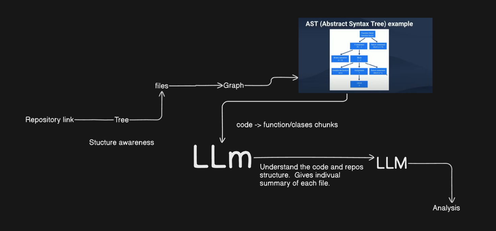

# CodeGradeAI 🧠💻

**CodeGradeAI** is an AI-powered assistant for intelligent codebase evaluation. It helps developers and teams receive automated insights on the structure, quality, and maintainability of their repositories using advanced LLMs.

🌐 **Live Demo**: [https://code-grade-ai-v6sx.vercel.app/](https://code-grade-ai-v6sx.vercel.app/)

## 🧠 How It Works

> The diagram above outlines the core pipeline:
- Takes a **repository link** and parses its **file tree**.
- Builds a **graph** using structure-aware logic to track code relationships.
- Extracts code into **function/class chunks** and feeds them to a **LLM**.
- Generates **file-wise summaries**, **vectorized insights**, and **PDF-style documentation templates**.
- Performs a **multi-dimensional analysis** based on key engineering metrics.

## 🛠️ Technologies Used

### AI/ML Stack
- **LangChain** - Framework for building LLM applications
- **Groq API** - High-performance LLM inference (Llama 3.3/3.1)
- **HuggingFace Inference API** - Embeddings model (BAAI/bge-base-en-v1.5)
- **RAG (Retrieval-Augmented Generation)** - Architecture for enhanced AI analysis

### Code Analysis
- **Babel Parser** - AST parsing for JavaScript/TypeScript
- **Babel Traverse** - AST traversal and transformation
- **GitHub API** - Repository content retrieval

### Frontend
- **React 19** - Modern UI framework
- **Vite** - Fast build tool and dev server
- **TailwindCSS** - Utility-first CSS framework
- **Recharts** - Data visualization library for charts
- **Lucide React** - Icon library

### Backend
- **Node.js** - JavaScript runtime
- **Express.js** - Web application framework
- **MongoDB** - Database for caching analysis results
- **Mongoose** - MongoDB object modeling

### Development Tools
- **ESLint** - Code linting
- **Nodemon** - Development server auto-reload
- **dotenv** - Environment variable management

## 📋 Approach

### 1. Repository Parsing
- Fetches repository contents via GitHub API
- Recursively traverses directory structure
- Extracts code files (JS/TS/JSX/TSX) and documentation (MD)
- Ignores common directories (node_modules, .git, etc.)

### 2. Dependency Graph Construction
- Parses import statements using Babel AST parser
- Builds adjacency list representing file dependencies
- Applies topological sorting to determine optimal processing order
- Ensures dependencies are analyzed before dependent files

### 3. Code Chunking & Embedding
- Splits code files into semantic chunks based on AST nodes
- Creates vector embeddings using HuggingFace embeddings model
- Stores embeddings in in-memory vector store for efficient retrieval

### 4. RAG-Based Analysis
- Implements Retrieval-Augmented Generation (RAG) architecture
- For each file:
  - Retrieves relevant code chunks using semantic search
  - Generates file-wise summaries using Groq LLM
  - Analyzes code structure, logic, and key components
- Combines all file summaries for repository-level analysis

### 5. Multi-Dimensional Scoring
- Evaluates code across 10 key metrics:
  - Code Readability (8% weight)
  - Code Structure & Modularity (8% weight)
  - Documentation & Comments (8% weight)
  - Error Handling & Edge Case Coverage (8% weight)
  - Test Coverage & Quality (8% weight)
  - Scalability & Maintainability (8% weight)
  - Efficiency (8% weight)
  - Extensibility (8% weight)
  - AI/Tool Usage Appropriateness (8% weight)
  - Code Complexity & Logic Quality (20% weight)
- Calculates weighted overall score (out of 10)
- Generates detailed remarks and improvement suggestions

### 6. Caching & Optimization
- Stores analysis results in MongoDB for faster retrieval
- Avoids re-analyzing repositories that have been analyzed before
- Reduces API calls and processing time

### 7. Visualization & Export
- Displays results in interactive charts (radar, bar, pie)
- Provides detailed metric breakdowns
- Allows export of analysis results as JSON

## 🎯 Use Cases

### 1. Code Quality Assessment
- **For Developers**: Get instant feedback on code quality before submitting PRs
- **For Teams**: Establish consistent code quality standards across projects
- **For Code Reviews**: Automated pre-review analysis to identify potential issues

### 2. Project Onboarding
- **For New Team Members**: Quickly understand codebase structure and quality
- **For Managers**: Assess project maintainability and technical debt
- **For Technical Leads**: Identify areas requiring refactoring or improvement

### 3. Technical Due Diligence
- **For Acquisitions**: Evaluate code quality of potential acquisition targets
- **For Vendor Assessment**: Analyze third-party code quality before integration
- **For Audits**: Comprehensive code quality reports for compliance

### 4. Continuous Improvement
- **For Refactoring**: Identify files and areas needing improvement
- **For Documentation**: Generate code documentation and summaries
- **For Best Practices**: Ensure code follows industry standards and patterns

### 5. Educational Purposes
- **For Students**: Learn about code quality metrics and best practices
- **For Teaching**: Demonstrate code analysis techniques and tools
- **For Learning**: Understand how AI can assist in code review

### 6. Portfolio Evaluation
- **For Job Seekers**: Assess and improve GitHub portfolio quality
- **For Recruiters**: Quickly evaluate candidate code quality
- **For Freelancers**: Showcase code quality to potential clients

## ⚙️ Key Features

- 📂 File-wise and project-wide understanding
- 📈 Metric-based scoring (10 comprehensive metrics)
- 📄 Summary generation for every file
- 📎 AST-based parsing for structured comprehension
- 🧾 Generates vectorized templates for code documentation
- 📊 Analysis stored in structured JSON output
- 💾 MongoDB caching for faster results
- 📉 Interactive data visualization (radar, bar, pie charts)
- 🔄 Dependency-aware processing order
- 🎯 Weighted scoring system for accurate evaluation

